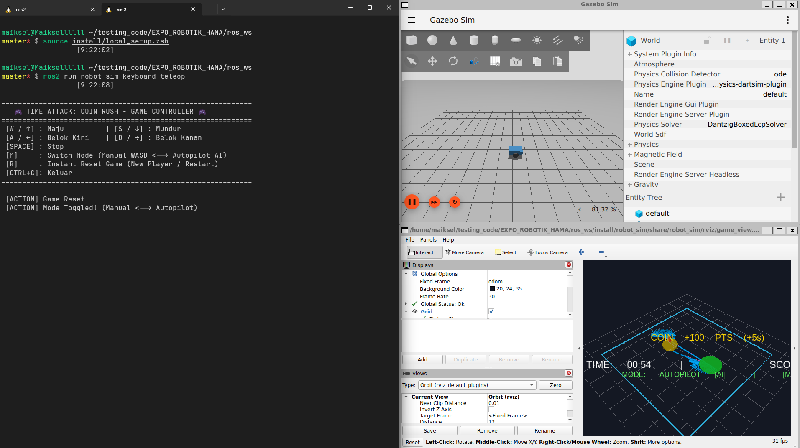

# 🎮 Robot Sim: Time Attack Coin Rush

[](https://docs.ros.org/)
[](https://gazebosim.org/)
[](https://www.python.org/)

Paket simulasi robotik interaktif berbasis **ROS 2** dan **Gazebo Sim** yang dirancang untuk **Expo / Demonstrasi Robotika**. Robot bertugas mengumpulkan koin target yang muncul secara acak dan dinamis di dalam arena berbatas, dilengkapi dengan sistem skor, combo multiplier, visualisasi 3D HUD di RViz2, serta mode ganda (**Manual Player WASD** dan **Autonomous AI Controller**).

<div align="center">
  
</div>

---

## 📋 Daftar Isi
- [Persyaratan Sistem (Prerequisites)](#-persyaratan-sistem-prerequisites)
- [Instalasi & Build Workspace](#-instalasi--build-workspace)
  - [1. Buat ROS 2 Workspace & Clone Repository](#1-buat-ros-2-workspace--clone-repository)
  - [2. Install Dependensi](#2-install-dependensi)
  - [3. Build Package dengan Colcon](#3-build-package-dengan-colcon)
- [Cara Menjalankan Simulasi](#-cara-menjalankan-simulasi)
  - [Terminal 1: Jalankan Game & Simulasi](#terminal-1-jalankan-game--simulasi)
  - [Terminal 2: Jalankan Keyboard Controller](#terminal-2-jalankan-keyboard-controller)
- [Kontrol Keyboard & Fitur Game](#-kontrol-keyboard--fitur-game)
- [Arsitektur & Komunikasi Topik ROS 2](#-arsitektur--komunikasi-topik-ros-2)
- [Struktur Direktori](#-struktur-direktori)
- [Lisensi](#-lisensi)

---

## 💻 Persyaratan Sistem (Prerequisites)

Sebelum menginstal paket ini, pastikan sistem operasi dan perangkat lunak pendukung berikut telah terpasang:

1. **Sistem Operasi**:
   - Ubuntu 24.04 LTS (disarankan untuk ROS 2 Jazzy) atau Ubuntu 22.04 LTS (ROS 2 Humble).
2. **ROS 2**:
   - [ROS 2 Jazzy Jalisco](https://docs.ros.org/en/jazzy/) atau [ROS 2 Humble Hawksbill](https://docs.ros.org/en/humble/).
3. **Gazebo Sim & Bridge**:
   - Paket `ros_gz_sim` dan `ros_gz_bridge`.
4. **Alat Build & Utilitas**:
   - `colcon`, `rosdep`, `git`, dan `python3`.

```bash
# Pastikan rosdep dan colcon telah terinstal
sudo apt update
sudo apt install -y python3-colcon-common-extensions python3-rosdep git
```

---

## 🛠️ Instalasi & Build Workspace

### 1. Buat ROS 2 Workspace & Clone Repository
Buat direktori workspace baru (misalnya `~/ros2_ws`) dan clone repository ini ke folder `src/`:

```bash
# 1. Buat folder workspace dan subfolder src
mkdir -p ~/ros2_ws/src
cd ~/ros2_ws/src

# 2. Clone repository robot_sim
git clone https://github.com/michael-aditya/robot_sim.git
```

> **Catatan jika sudah punya repository lokal:**
> Jika Anda sudah memiliki folder `robot_sim` di komputer, cukup salin folder tersebut ke dalam direktori `~/ros2_ws/src/`.

### 2. Install Dependensi
Jalankan `rosdep` untuk menginstal seluruh dependensi paket secara otomatis:

```bash
cd ~/ros2_ws

# Inisialisasi & update rosdep (jika belum pernah)
sudo rosdep init 2>/dev/null || true
rosdep update

# Install semua dependency yang dibutuhkan oleh paket di dalam workspace
rosdep install --from-paths src --ignore-src -r -y
```

Atau pasang dependensi ROS–Gazebo secara manual jika diperlukan:
```bash
sudo apt install -y \
  ros-${ROS_DISTRO}-ros-gz \
  ros-${ROS_DISTRO}-ros-gz-sim \
  ros-${ROS_DISTRO}-ros-gz-bridge \
  ros-${ROS_DISTRO}-rviz2
```

### 3. Build Package dengan Colcon
Lakukan proses kompilasi menggunakan `colcon`:

```bash
cd ~/ros2_ws

# Build package robot_sim
colcon build --packages-select robot_sim --symlink-install
```

Setelah proses build selesai, lakukan **source** environment ke terminal Anda:

```bash
# Untuk Bash:
source ~/ros2_ws/install/setup.bash

# Untuk Zsh:
source ~/ros2_ws/install/setup.zsh
```

---

## 🚀 Cara Menjalankan Simulasi

Simulasi dijalankan menggunakan **dua terminal**:

### **Terminal 1: Jalankan Game & Simulasi**
Terminal ini akan meluncurkan Gazebo Sim, memuat dunia (*world*), melakukan *spawn* robot, menghubungkan bridge ROS–Gazebo, menjalankan node logika permainan (*Master Node*), serta membuka RViz2 dengan konfigurasi 3D HUD.

```bash
source ~/ros2_ws/install/setup.bash
ros2 launch robot_sim simulation.launch.py
```

### **Terminal 2: Jalankan Keyboard Controller**
Buka terminal baru untuk mengontrol robot secara interaktif dan mengatur kontrol permainan:

```bash
source ~/ros2_ws/install/setup.bash
ros2 run robot_sim keyboard_teleop
```

---

## 🎮 Kontrol Keyboard & Fitur Game

### ⌨️ Panduan Tombol (Keybindings)

| Tombol | Aksi | Deskripsi |
| :--- | :--- | :--- |
| **`W` / `↑`** | **Maju** | Robot bergerak maju dengan kecepatan linear konstan. |
| **`S` / `↓`** | **Mundur** | Robot bergerak mundur. |
| **`A` / `←`** | **Belok Kiri** | Robot berputar ke arah kiri (*counter-clockwise*). |
| **`D` / `→`** | **Belok Kanan** | Robot berputar ke arah kanan (*clockwise*). |
| **`Space`** | **Stop / Rem** | Menghentikan pergerakan robot seketika. |
| **`M`** | **Ganti Mode** | Beralih antara **🎮 Manual WASD** $\leftrightarrow$ **🤖 Autopilot AI**. |
| **`R`** | **Instant Reset** | Mereset skor, timer, dan koin dalam 0.1 detik untuk pemain baru. |
| **`Ctrl + C`** | **Keluar** | Menutup controller dan mengembalikan konfigurasi terminal. |

---

### 🌟 Fitur Utama Permainan
1. **Mode Ganda (*Dual Mode*)**:
   - **Mode Manual:** Pengunjung expo dapat bermain langsung mengemudikan robot.
   - **Mode Autopilot (AI PID):** Robot secara otomatis menghitung orientasi target, berputar (*turn-in-place*), dan melaju dengan *smooth deceleration* menuju koin (sangat atraktif untuk demonstrasi otomatisasi).
2. **Sistem Skor & Dynamic Target Spawning**:
   - Target berupa koin 3D emas berputar (*hovering coin*) yang muncul acak dalam arena $7 \times 7\text{ meter}$.
   - Setiap koin yang berhasil diambil memberikan **+100 Poin** dan **+5 Detik Tambahan Waktu**.
   - **Combo Multiplier:** Mengambil koin berikutnya dalam interval $< 4$ detik memicu kelipatan poin combo (x2, x3, dst.).
3. **Floating 3D HUD di RViz2**:
   - Papan informasi waktu hitung mundur (*countdown*), skor berjalan, indikator mode, batas arena neon, jejak lintasan robot (*breadcrumb trail*), serta efek kilatan hijau saat koin berhasil diraih.
4. **Instant Game Reset**:
   - Tombol `R` mereset permainan tanpa perlu me-restart simulasi Gazebo maupun RViz2.

---

## 📡 Arsitektur & Komunikasi Topik ROS 2

```
                       +-------------------+
                       |  keyboard_teleop  |
                       +---------+---------+
                                 |
           +---------------------+---------------------+
           | /cmd_vel_manual                           | /game_control ('TOGGLE_MODE', 'RESET')
           v                                           v
+-------------------------------------------------------------+
|                   time_attack_master_node                   |
|  - Game State & Timer (60s countdown)                       |
|  - Target Spawning & Score / Combo System                   |
|  - Autonomous PID Waypoint Navigation Controller            |
|  - 3D Visualization Marker HUD Engine                       |
+------------------------------+------------------------------+
                               |
            +------------------+------------------+
            | /cmd_vel                            | /visualization_marker_array
            v                                     v
+-----------------------+              +----------------------+
|     ros_gz_bridge     |              |        rviz2         |
|  (ROS <-> Gazebo Sim) |              |   (Floating 3D HUD)  |
+-----------+-----------+              +----------------------+
            |
            v
+-----------------------+
|      Gazebo Sim       |
|  (my_robot & world)   |
+-----------------------+
```

### 📋 Ringkasan Topik Utama:
- `/cmd_vel` (`geometry_msgs/msg/Twist`): Perintah kecepatan pergerakan yang dikirim ke robot di Gazebo.
- `/cmd_vel_manual` (`geometry_msgs/msg/Twist`): Perintah kecepatan manual dari keyboard teleop.
- `/odom` (`nav_msgs/msg/Odometry`): Umpan balik posisi dan orientasi (*odometry*) robot dari simulasi.
- `/game_control` (`std_msgs/msg/String`): Sinyal event kontrol game (ganti mode, reset game).
- `/visualization_marker_array` (`visualization_msgs/msg/MarkerArray`): Marker 3D untuk arena, koin, jejak lintasan, dan HUD teks di RViz2.

---

## 📂 Struktur Direktori

```text
robot_sim/
├── launch/
│   └── simulation.launch.py       # Launch file utama (Gazebo, Bridge, Master Node, RViz2)
├── models/
│   └── robot.sdf                  # Model 3D robot differential drive dengan sensor & plugin
├── resource/
│   └── robot_sim                  # Marker index ament
├── robot_sim/
│   ├── __init__.py
│   ├── keyboard_teleop.py         # Controller terminal non-blocking interaktif
│   └── time_attack_master_node.py # Game engine, autopilot PID, scoring & 3D HUD generator
├── rviz/
│   └── game_view.rviz             # Konfigurasi RViz2 untuk sudut pandang 3D Game HUD
├── test/                          # Unit testing (flake8, copyright, pep257)
├── worlds/
│   └── empty.sdf                  # Lingkungan dunia Gazebo dengan konfigurasi fisika ODE
├── package.xml                    # Manifest paket ROS 2
├── setup.cfg                      # Konfigurasi instalasi executable
├── setup.py                       # Setup script Python package
└── README.md                      # Dokumentasi lengkap
```

---
